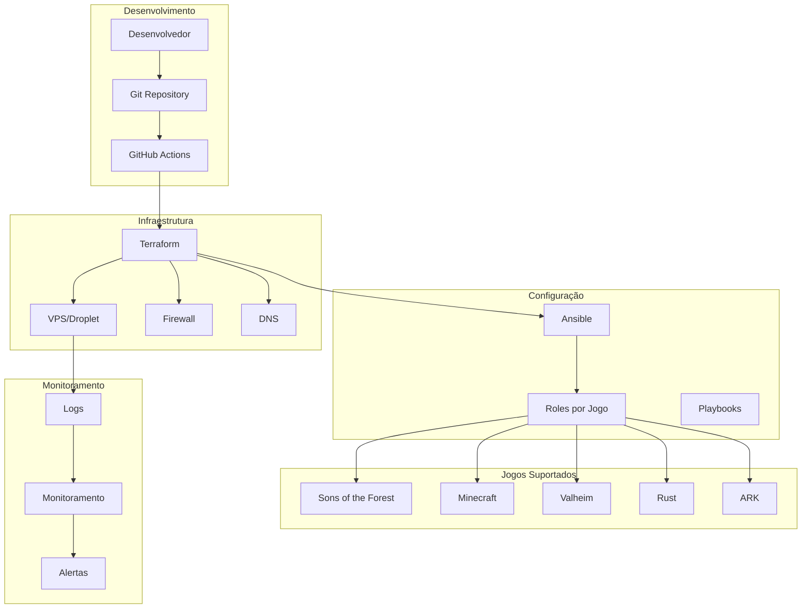
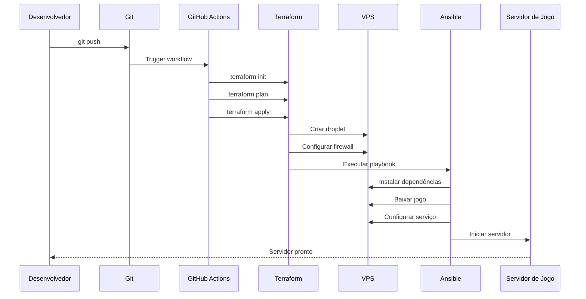
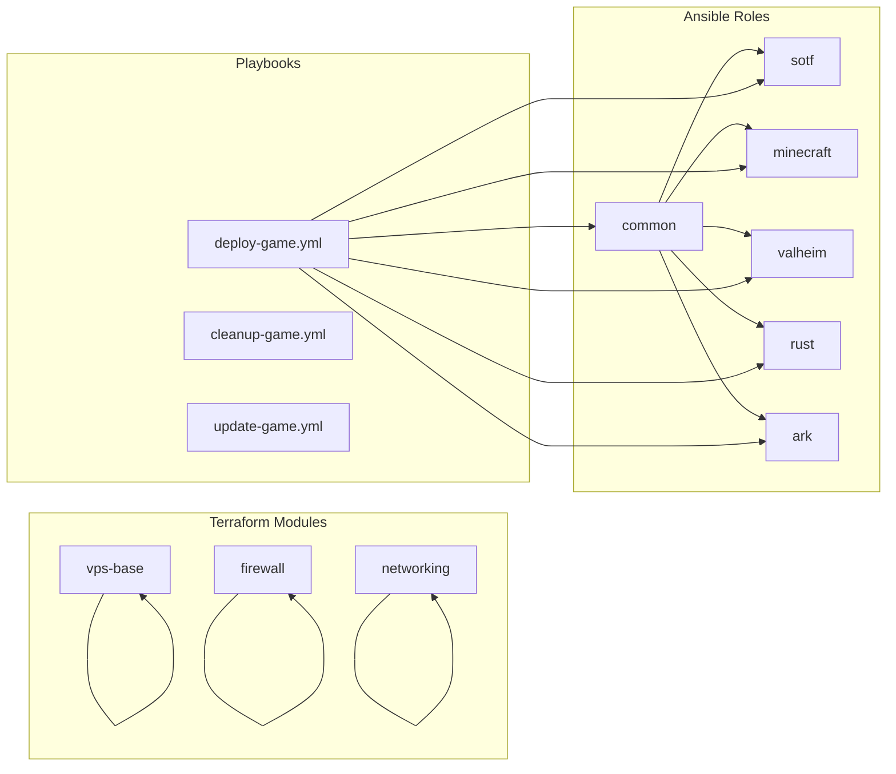
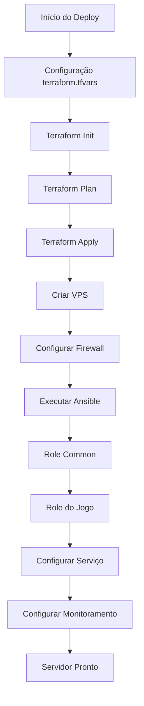
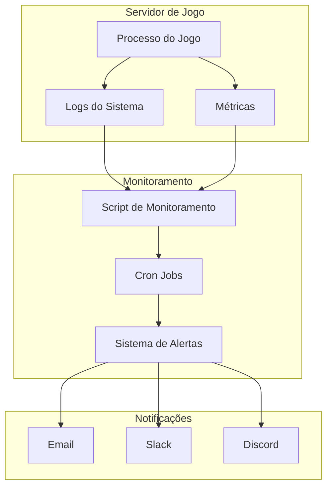
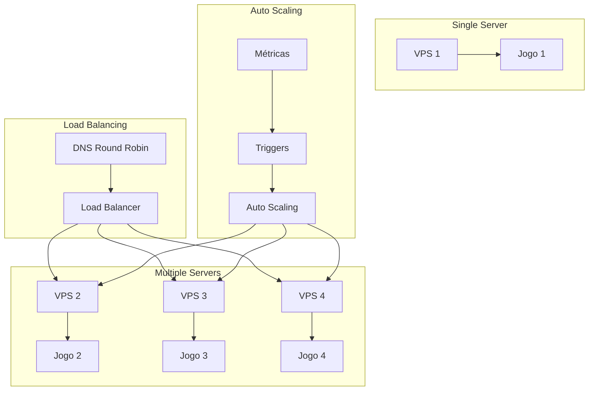
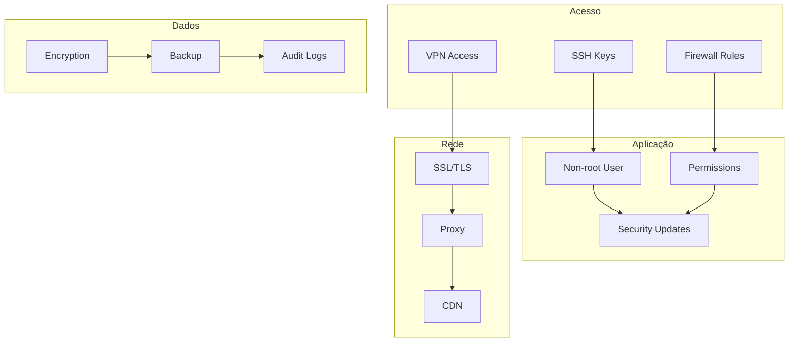

# Diagrama de Arquitetura - Game.Servers

## Visão Geral do Sistema

## Fluxo de Deploy

## Arquitetura de Módulos

## Fluxo de Dados

## Estrutura de Diretórios

```mermaid
graph TD
    ROOT[Game.Servers]
    
    subgraph "Terraform"
        TF_MAIN[main.tf]
        TF_VARS[variables.tf]
        TF_OUT[outputs.tf]
        TF_MODULES[modules/]
        TF_ENV[environments/]
    end
    
    subgraph "Ansible"
        ANS_ROLES[roles/]
        ANS_PLAY[playbooks/]
        ANS_INV[inventory/]
        ANS_CFG[ansible.cfg]
    end
    
    subgraph "Documentação"
        DOCS[docs/]
        README[README.md]
        LICENSE[LICENSE]
    end
    
    subgraph "Scripts"
        SETUP[setup.sh]
        SETUP_PS[setup.ps1]
    end
    
    subgraph "CI/CD"
        GITHUB[.github/workflows/]
    end
    
    ROOT --> TF_MAIN
    ROOT --> TF_VARS
    ROOT --> TF_OUT
    ROOT --> TF_MODULES
    ROOT --> TF_ENV
    ROOT --> ANS_ROLES
    ROOT --> ANS_PLAY
    ROOT --> ANS_INV
    ROOT --> ANS_CFG
    ROOT --> DOCS
    ROOT --> README
    ROOT --> LICENSE
    ROOT --> SETUP
    ROOT --> SETUP_PS
    ROOT --> GITHUB
```

## Monitoramento e Alertas

## Escalabilidade

## Segurança

---

**Nota**: Estes diagramas podem ser visualizados usando ferramentas como Mermaid Live Editor ou VS Code com extensão Mermaid.
