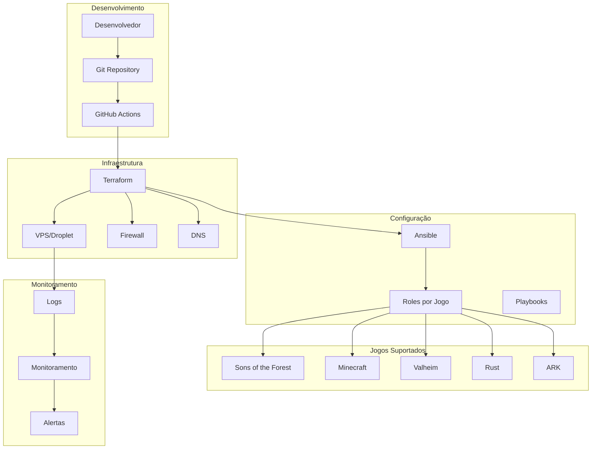

# Arquitetura do Game.Servers

Este documento descreve a arquitetura completa do sistema Game.Servers, um framework modular de Infrastructure as Code (IaC) para hospedar servidores de jogos.

## 🏗️ Visão Geral da Arquitetura

O Game.Servers é construído com base em princípios de:
- **Modularidade**: Componentes reutilizáveis e plugáveis
- **Escalabilidade**: Suporte a múltiplos servidores e jogos
- **Automação**: Deploy e configuração completamente automatizados
- **Versionamento**: Controle de versão via Git
- **Segurança**: Práticas de segurança integradas

## 📊 Diagrama de Arquitetura



## 🔧 Componentes Principais

### 1. Terraform (Provisionamento)

#### Módulos
- **`vps-base`**: Módulo genérico para criação de VPS
- **`firewall`**: Configuração de firewall por tipo de jogo
- **`networking`**: Configuração de rede e DNS

#### Estrutura
```
terraform/
├── main.tf                 # Configuração principal
├── variables.tf            # Definições de variáveis
├── outputs.tf              # Outputs do sistema
├── modules/                # Módulos reutilizáveis
│   ├── vps-base/
│   ├── firewall/
│   └── networking/
└── environments/           # Configurações por ambiente
    ├── dev.tfvars
    └── prod.tfvars
```

### 2. Ansible (Configuração)

#### Roles
- **`common`**: Configurações comuns a todos os servidores
- **`sotf`**: Configuração específica para Sons of the Forest
- **`minecraft`**: Configuração específica para Minecraft
- **`valheim`**: Configuração específica para Valheim
- **`rust`**: Configuração específica para Rust
- **`ark`**: Configuração específica para ARK

#### Playbooks
- **`deploy-game.yml`**: Deploy principal de servidores
- **`cleanup-game.yml`**: Limpeza e remoção de servidores
- **`update-game.yml`**: Atualização de servidores

### 3. Estrutura de Diretórios

```
Game.Servers/
├── terraform/              # Provisionamento
│   ├── main.tf
│   ├── variables.tf
│   ├── outputs.tf
│   ├── modules/
│   └── environments/
├── ansible/                # Configuração
│   ├── roles/
│   ├── playbooks/
│   └── templates/
├── web-app/                # Interface web (futuro)
│   ├── api/
│   └── frontend/
├── docs/                   # Documentação
│   ├── sotf-setup.md
│   ├── architecture.md
│   └── adding-games.md
├── .github/workflows/      # CI/CD
└── README.md
```

## 🔄 Fluxo de Deploy

### 1. Inicialização
```bash
# Desenvolvedor executa
terraform init
terraform plan
terraform apply
```

### 2. Provisionamento (Terraform)
1. Cria VPS no provedor de cloud
2. Configura firewall com portas específicas
3. Aplica tags e metadados
4. Chama Ansible para configuração

### 3. Configuração (Ansible)
1. Instala dependências básicas (role `common`)
2. Executa role específica do jogo
3. Configura serviço systemd
4. Inicia monitoramento
5. Aplica configurações de segurança

### 4. Validação
1. Verifica se serviços estão rodando
2. Testa conectividade de rede
3. Valida configurações do jogo
4. Gera relatório de status

## 🎮 Suporte a Jogos

### Sons of the Forest
- **Porta**: 8766 (TCP/UDP)
- **Download**: Via SteamCMD
- **Configuração**: JSON
- **Dependências**: SteamCMD, lib32gcc-s1

### Minecraft
- **Porta**: 25565 (TCP/UDP)
- **Download**: Direto do Mojang
- **Configuração**: server.properties
- **Dependências**: Java 17+

### Valheim
- **Porta**: 2456, 2457 (TCP/UDP)
- **Download**: Via SteamCMD
- **Configuração**: start_server.sh
- **Dependências**: SteamCMD, lib32gcc-s1

### Rust
- **Porta**: 28015, 28016 (TCP/UDP)
- **Download**: Via SteamCMD
- **Configuração**: server.cfg
- **Dependências**: SteamCMD, lib32gcc-s1

### ARK: Survival Evolved
- **Porta**: 7777, 7778, 27015 (TCP/UDP)
- **Download**: Via SteamCMD
- **Configuração**: GameUserSettings.ini
- **Dependências**: SteamCMD, lib32gcc-s1

## 🔐 Segurança

### Práticas Implementadas
- **Usuário não-root**: Serviços rodam como `gameserver`
- **Firewall**: Regras específicas por jogo
- **Logs**: Monitoramento de atividades
- **Backup**: Backup automático de saves
- **Atualizações**: Sistema sempre atualizado

### Configurações de Firewall
```hcl
# Exemplo para Sons of the Forest
inbound_rule {
  protocol         = "tcp"
  port_range       = "8766"
  source_addresses = ["0.0.0.0/0"]
}
```

## 📊 Monitoramento

### Métricas Coletadas
- **CPU**: Uso de processador
- **RAM**: Uso de memória
- **Disk**: Espaço em disco
- **Network**: Conectividade e portas
- **Services**: Status dos serviços

### Logs
- **Sistema**: journalctl
- **Jogo**: Logs específicos do jogo
- **Monitoramento**: Logs de monitoramento
- **Acesso**: Logs de SSH e conexões

### Alertas
- **Serviço inativo**: Notificação imediata
- **Recursos altos**: Alerta de CPU/RAM
- **Conectividade**: Problemas de rede
- **Erros**: Erros críticos do sistema

## 🚀 Escalabilidade

### Múltiplos Servidores
```hcl
# Exemplo: 3 servidores SotF
resource "digitalocean_droplet" "sotf_servers" {
  count  = 3
  name   = "sotf-server-${count.index + 1}"
  # ... configurações
}
```

### Load Balancing
- **DNS Round Robin**: Distribuição via DNS
- **Nginx**: Proxy reverso
- **Health Checks**: Verificação de saúde
- **Auto-scaling**: Escalabilidade automática

### Multi-região
```hcl
# Exemplo: Servidores em múltiplas regiões
locals {
  regions = ["nyc3", "sfo3", "fra1"]
}

resource "digitalocean_droplet" "global_servers" {
  for_each = toset(local.regions)
  region   = each.value
  # ... configurações
}
```

## 🔄 CI/CD

### GitHub Actions
```yaml
# Exemplo de workflow
name: Deploy Game Server
on:
  push:
    branches: [main]
  workflow_dispatch:

jobs:
  deploy:
    runs-on: ubuntu-latest
    steps:
      - uses: actions/checkout@v3
      - name: Setup Terraform
        uses: hashicorp/setup-terraform@v2
      - name: Deploy
        run: |
          cd terraform
          terraform init
          terraform apply -auto-approve
```

### Ambientes
- **Development**: Testes e desenvolvimento
- **Staging**: Testes de integração
- **Production**: Ambiente de produção

## 📈 Performance

### Otimizações
- **SSD**: Discos de alta performance
- **RAM**: Configuração adequada de memória
- **CPU**: Processadores otimizados
- **Network**: Conexão de alta velocidade

### Benchmarks
- **Sons of the Forest**: 8-16 jogadores por servidor
- **Minecraft**: 20-50 jogadores por servidor
- **Valheim**: 10-20 jogadores por servidor
- **Rust**: 50-100 jogadores por servidor
- **ARK**: 10-20 jogadores por servidor

## 🛠️ Manutenção

### Atualizações
- **Sistema**: Atualizações automáticas
- **Jogos**: Atualizações via SteamCMD
- **Dependências**: Atualizações de bibliotecas
- **Segurança**: Patches de segurança

### Backup
- **Saves**: Backup automático de saves
- **Configurações**: Backup de configurações
- **Logs**: Backup de logs importantes
- **Sistema**: Snapshot da VPS

### Limpeza
- **Logs antigos**: Limpeza automática
- **Arquivos temporários**: Limpeza regular
- **Cache**: Limpeza de cache
- **Backups antigos**: Rotação de backups

## 🔮 Roadmap

### Próximas Funcionalidades
- **Interface Web**: Dashboard para gerenciamento
- **API REST**: API para automação
- **Métricas**: Prometheus + Grafana
- **Alertas**: Notificações via Slack/Discord
- **Multi-cloud**: Suporte a AWS, Azure
- **Kubernetes**: Deploy em K8s
- **Auto-scaling**: Escalabilidade automática
- **CDN**: Distribuição global de conteúdo

### Melhorias Planejadas
- **Performance**: Otimizações de performance
- **Segurança**: Melhorias de segurança
- **Monitoramento**: Monitoramento avançado
- **Documentação**: Documentação expandida
- **Testes**: Testes automatizados
- **CI/CD**: Pipeline de CI/CD completo

## 📚 Recursos Adicionais

### Documentação
- [Setup do Sons of the Forest](./sotf-setup.md)
- [Adicionando Novos Jogos](./adding-games.md)
- [Troubleshooting](./troubleshooting.md)
- [API Reference](./api-reference.md)

### Links Úteis
- [Terraform Documentation](https://terraform.io/docs)
- [Ansible Documentation](https://docs.ansible.com)
- [DigitalOcean API](https://docs.digitalocean.com)
- [SteamCMD Documentation](https://developer.valvesoftware.com/wiki/SteamCMD)

---

**Nota**: Esta arquitetura é evolutiva e será atualizada conforme novas funcionalidades são adicionadas ao sistema.
